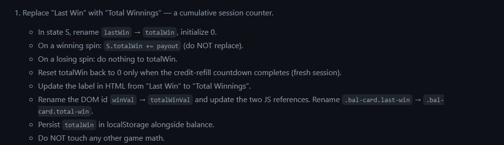
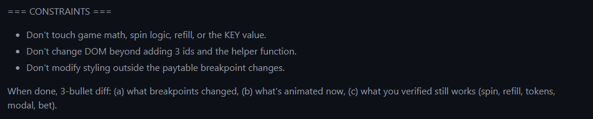
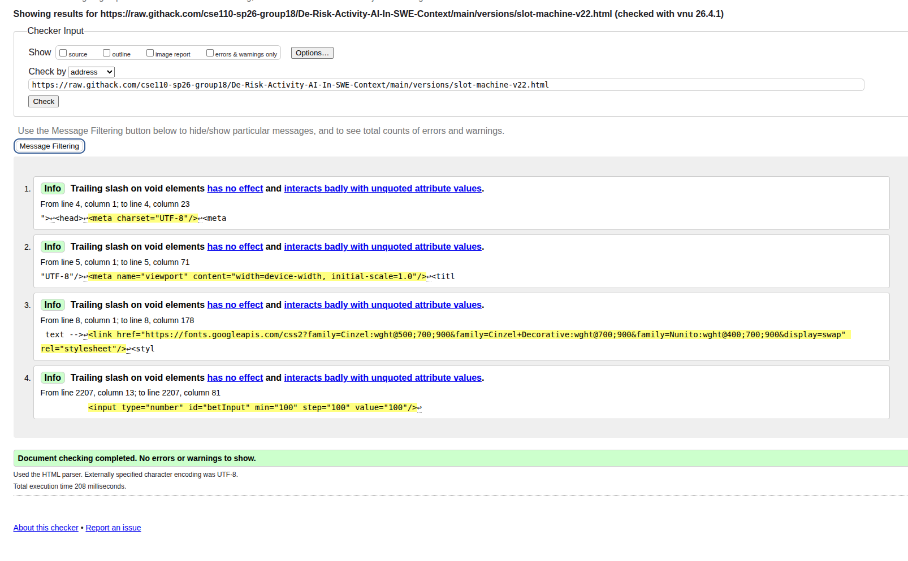

# Final Report

## Table of Contents
- [Planning](#planning)
- [Execution](#execution)
- [Testing](#testing)
- [Conclusion](#conclusions)

## Planning
Our research was split into two different types of research user based and domain based. The user based research was looking into the different types of reviews people gave on different slot machine apps. This is meant to set up two sides one in which is the positive reviews talking about features of designs that the users liked and would like to see again. The other side was the negative reviews, parts about different slot machine apps had that a person didn't like such as the users not being able to play for long or there being accessibility issues for others. In the domain side of research we listed different mechanics that had research done about them from others that showed which game mechanics were the most likely to keep user to keep playing for longer. 

### User Based research/planning:
In our user based research we found different reviews in which gave us an idea about the different things about slot machines that users liked. There were reviews that showed the slot machines that had bounses for wins or they had features that kept making the game exciting like different themes were fun to keep playing. Themes and sounds that made the slot machines feel like actually casinos were some of the most liked apps. Some said that when the bidding was allowed to be small and resonable allowed them to play for longer and sometimes help with their gambling problems. For the excat opposite reason people hated certain apps, stating that the bids were too high or as they progressed in the app it become harder and harder to play so they gave up. 

#### User Personas and User Stories
2 personas: 
Persona 1:
Name: Bruno Mars
Age: 40
Background: singer and entertainer, former gambler, and a Las Vegas lover 

Wants and Needs:
- Wants to have the same fun as he would gambling in Vegas without the actual risk 
- Enjoys flashy visuals and rewards
- Wants the feeling of winning

Does Not want or Does Not need :
- Does not want to gamble with real money
- Confusing or underwhelming interfaces
- Games that differ too much from an actual casino game 

Persona 2:
Name: Omair Qazi 
Age: 22
Background: graduate college student, a Teacher’s Assistant for a Software Engineering course

Wants and Needs:
- A no-brainer game he can play after long hours of grading assignments 
- An exciting game that is thrilling but also not stressful 

Does Not want or Does Not need :
- features that are not explained 
- Games that differ too much from an actual casino game 

5 user stories: 
1. As a former gambler, 
    What’s important to me about this app is that it satisfied my gambling habits when I crave that dopamine rush. I want to feel like I’m truly at the casino. I want to be able to play more than just a couple of spins a day since that’s what I’ve noticed from other slot machine apps and websites. 
2. As a rational person,
    I know I can’t win money from the game, but I will play for several rounds every day just for fun and to see my luck, sometimes to kill time. So I need tokens supplied every day, and the UI looks comfortable, rather than like the fancy ones in the casino. 
3. As a blue collar worker
    I often play after work as a way to have fun and have a good time, but constantly seeing the same UI gets boring. I want to be able to win new themes and new winnings to customize my experience to something I like. Also having the ability to spin the slot machine anywhere makes it easier for me after working with my hands a lot and gives similar vibes to casino play. 
4. As a competitive player,
    I want a ranking system to be able to play against my friends so I can compare my performance. I also want a starter package that I get for joining because of a friend's referral so I feel rewarded for joining the game. I want ways to collaborate with my friends, like rewards for sharing big wins with friends.
5. As a bored student in a lecture, 
    I want a simple, fast, high-excitement game that I can conveniently pick up and play,
    So I can ease my boredom without having to commit to a long playthrough or face a learning curve

These kinds of user based research led us to be able to design our app with a more user focused idea going in. We created User personas to have an idea of what kind of person would be planning our game, their wants and needs and how can we facilate that in our app. We were also able to create different user stories that weren't as detailed as the persona but it gave us different secenrios of differet people playing our game such as causal playing college student who wants something fun, so we added different themes to make it more engagning. We realized as developers we needed to look at our app in a user viewpoint to really sell our app.

This is how we set up our thinking on user based research which made it easy for us to through out ideas and connect them to later planning. 

### Domain based research/planning:
When we did our domain based research we looked at the different mechanics that make slot machines more appealing and what keeps users coming back to them. We took a look at color theory such as which colors are the most appealing and also makes user gamble more. What we found were gold, purple and red were the most appealing colors and specifically red was the color that made people gamble the most compared to red. We also did research on the mechanics to understand the inner workings of slot machines and how our slot should operate to provide and both appealing but exciting app. We looked at the return to player ration, the payline, and the bonouses given to players to fine tune these to give the best app we can make. Lastestly we looked at features that are known to attract users such as the jackpot, multiplers, free spins, a leaderboard for competion, and lastly the fact that casinos don't have clocks so people don't realize how long they are playing for.

This is how we formulated our thinking on domain based research and moved it over to planning and prototyping. 

### Prototyping
With this type of research we were able to formulate the desgin of our app to make a small protprototype of what we wanted for our app to look like by the end our different iterations. We also used different reference photos to be able to show the app of different slot machines to hopefully be able to recreate the casino like feeling that users wanted. 

Our prototype was used as away to help the team memembers who were running the different iterations to be able to get an idea of how we as collective wanted our app to be like. When planning and prototyping we first used opus claude as way to get the first iteration as detailed as possible with maximum thinking power. We then made the choice to use sonnent for the rest of executations to save on time and token usage. So for our memember who took on the iterations they had this prototype as a base as it included our ideas of color scheme based on our domain research the accessibility information based on our user based research and more features based on our different research. 

## Execution
To be able to work on the execution in most time efficent manner and to free up reasources we split the work of the different iterations into different sets for memembers who owned claude. The set up was like this 
- Daniel John 2-5 entries
- Ajay Anubolu 6-9 entries
- Howard Guan 10-13 entries
- Aaron Delgado 14-16 entries
- Anvay Patil 17-20 entries

This allowed for us to conserve our token usage while also allowing for fresh eyes to be put to the creation of the app. Each memember had similar ways of handling the iterations and refinements. The memebers would set up goals that they had for the next iterations while also listing the fixes they want to make using their prompts and trying to get the AI to produce results. This allowed for the next person after them to be able to easily understand what the fixes were without having to read through every persons prompts. This was to allow for better time management so that we can make the iterations sooner than last warmup. After the first 5 one of memebers realized that the AI was keeping the same base case so they scraped it and remade it. After that most of the memembers were now trying to fix the UI's specific issues and the js specific issues and making improving the app little by little. Each person was using the miro to continue understanding the ideas we had as a group to keep the user viewpoint and the domain features we wanted to add. So for every prompt generations memembers were fixing issues that they saw on the previous verison while also seeing what could be added to include any features that we had come up in our planning stage. 

When talking about the refinement of each issues memembers try to first list all the fixes they needed some being a bit broad such as "While also creating the themes, create new element images for the reels so that they are more like the reference image with more gold and more like fancy looking elements instead of basic emojis." to very specific such as . 

With each one though we had to make sure the AI didn't stray or change parts of the project that we had already liked about the previous iterations. Due to the randomness of the AI this was needed and each memember listed it as time went on to keep the project as stable as possible. We also asked the AI to list the changes it made so that we were able to look at specific parts of the code instead of searching through the whole code base for the changes. This was meant to save time to be able to quickly see if something wasn't change correctly or there was a new issue

These were the different types of ideas we had when going about creating new prompts for refinement to make the AI be able to produce the result we wanted in our initial planning stages. 

## Testing
Our testing strategy followed a multi-layered, structured approach to ensure both technical reliability and a high-quality user experience. Rather than relying on trial-and-error, we established a master checklist that separated testing into three distinct categories: manual testing for visual behavior and user-facing flows, Playwright for repeatable browser interactions, and unit tests for isolated logic and state updates.

### Visual & Behavioral Testing Strategy
To maintain a software-engineering-focused workflow, we identified which repeatable actions should be automated—such as page load, spin interaction, and persistence after refresh—while reserving pure logic checks like payout, multiplier, and forced-grid behavior for our unit tests. 

Manual testing was central to our visual validation, specifically focusing on balance and bet behavior, spin flow, forced outcomes, auto-spin, refill flow, persistence, responsiveness, and accessibility. This ensured that the "feel" of the casino experience remained consistent across different themes and screen sizes, capturing interactive nuances that automated tests might miss.

### Automated Testing
We implemented two independent layers of automated tests to cover different aspects of the application:
- **Unit Testing (Vitest):** We extracted core game logic into a standalone module (`gameLogic.js`) to perform pure logic verification. Our unit tests cover 7 critical scenarios, including payout multiplier calculations, balance and free spin management, and the handling of forced test outcomes.
- **End-to-End Testing (Playwright):** To verify the user-facing interface, we implemented E2E tests for the final version of the slot machine (`slot-machine-v22.html`). These tests automate the browser to confirm that core UI elements are correctly rendered and that the application remains stable after user interaction.

### Standards and Compliance
- **HTML Validation:** To ensure code quality and cross-browser compatibility, we validated our HTML against W3C standards. Our final version passed with no errors or warnings, confirming a clean and standards-compliant implementation.

*W3C Validation results for slot-machine-v22.html showing no errors or warnings.*

## Conclusion
AI is capable of providing a basic prototype, however, it’s crucial that research is done prior to identify shortcomings and specify improvements
Having a clear vision of what you want the AI to do is vital; AI can not do everything you ask it to do despite clear instructions so it’s still important to learn and be able to hand code desired features and / or designs
Planning first allowed us to more easily identify what a good/bad slot machine looks like, so we were more qualified to judge the outcomes of each AI iteration. 
Having outlines users for our app allowed us to reflect more from their perspective and not only look at the app from a dev POV, but also the actual user and their needs. 
Collaborating and discussing as a team is required to create a good product as it allows for a variety of perspectives and accounts for nuances and details
In our team, and for our future projects, we will be able to utilize AI for basic prototypes and initial iterations of a software, but at the end of the day, the quality relies on how much research we had done before hand, and how much we can personally implement the features and experience we hope to provide.
